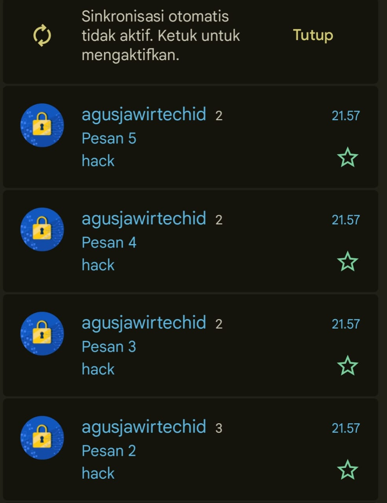
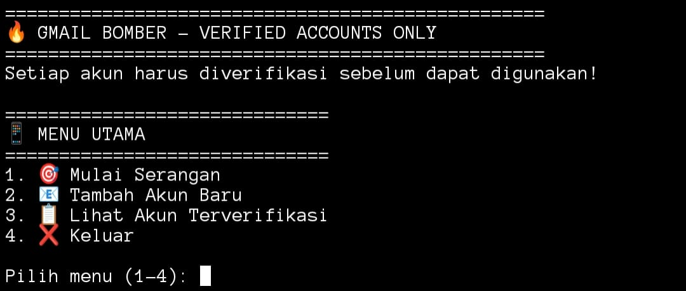

# 🚀 FyouGmail - Advanced Gmail Bomber

<div align="center">


**Tools Bombing Email Gmail dengan Sistem Rotasi Otomatis Multi-Akun**

**Fitur • Instalasi • Cara Pakai • Screenshot • Disclaimer**

</div>

---

## 📸 Screenshot

<div align="center">

### 🎯 Bukti Keberhasilan Spam  
<br>
<sub>Bukti pengiriman email massal berhasil</sub>

---

### 💻 Preview Program  
<br>
<sub>Tampilan program yang mudah digunakan</sub>

</div>

---

## ✨ Fitur

<div align="center">

| Fitur | Deskripsi | Status |
|-------|-----------|--------|
| 🔐 Verifikasi Akun | Cek akun Gmail sebelum digunakan | ✅ Aktif |
| 🔄 Rotasi Otomatis | Ganti akun otomatis saat limit | ✅ Aktif |
| 👥 Multi-Akun | Support banyak akun Gmail | ✅ Aktif |
| ☁️ Firebase Cloud | Simpan akun dan log di Firebase | ✅ Aktif |
| 📊 Statistik Real-Time | Monitoring live pengiriman | ✅ Aktif |
| 🛡️ Error Handling | Sistem pemulihan error kuat | ✅ Aktif |

</div>

---

## 🛠️ Instalasi

### Yang Diperlukan
- Python 3.8 atau lebih tinggi  
- Akun Gmail dengan **2-Step Verification** aktif  
- Koneksi internet stabil  

### Install Cepat

```bash
# Download repository
git clone https://github.com/agusjawirtechid/FyouGmail.git
cd FyouGmail

# Jalankan langsung
python3 spamgmail.py
```

---

## 🔑 Cara Mendapatkan App Password

### 1️⃣ Aktifkan 2-Step Verification
```
Kunjungi: https://myaccount.google.com/security
→ AKTIFKAN 2-Step Verification
```

### 2️⃣ Buat App Password
```
Buka: https://myaccount.google.com/apppasswords
→ Pilih "Mail"
→ Pilih "Other" → Nama: FyouGmail
→ Klik Generate
→ Salin password 16 karakter
```

---

## 🚀 Cara Pakai

### 🔧 Setup Pertama Kali
```bash
python3 spamgmail.py
```

### ➕ Menambah Akun Pertama
1. Pilih **2. Tambah Akun Baru**  
2. Masukkan alamat Gmail  
3. Tempel App Password (16 karakter)  
4. Tunggu hasil verifikasi (✓ Berhasil)

### 🎯 Memulai Serangan
1. Pilih **1. Mulai Serangan**  
2. Masukkan email target (harus @gmail.com)  
3. Isi pesan  
4. Tentukan jumlah email  
5. Lihat progress real-time  

---

## 🧾 Contoh Sesi

```python
🎯 GMAIL BOMBER - AKUN TERVERIFIKASI SAJA
==========================================

📱 MENU UTAMA
1. 🎯 Mulai Serangan
2. 📧 Tambah Akun Baru
3. 📋 Lihat Akun Terverifikasi
4. ❌ Keluar

Pilih: 1

✅ Ditemukan 3 akun terverifikasi:
   1. akun1@gmail.com
   2. akun2@gmail.com  
   3. akun3@gmail.com

🎯 TARGET SERANGAN
Target: korban@gmail.com
Pesan: Halo dari FyouGmail!
Jumlah: 50

🚀 MEMULAI SERANGAN...
[Akun1] ✓ Email 1/50 terkirim
[Akun2] ✓ Email 2/50 terkirim
[Akun3] ✓ Email 3/50 terkirim
...
📊 HASIL AKHIR: 50/50 email terkirim! ✅
```

---

## ⚡ Fitur Canggih

### 🔄 Rotasi Akun Pintar
- Deteksi limit otomatis  
- Ganti akun dengan mulus  
- Lanjut otomatis setelah error  

### 📡 Monitoring Real-Time
```python
🔄 Menggunakan akun: pengirim1@gmail.com
✅ 25/100 berhasil
⏳ Menunggu delay...
🔄 Beralih ke: pengirim2@gmail.com
```

### 🛡️ Pemulihan Error
- Auto-reconnect  
- Skip akun bermasalah  
- Detail error log  

---

## 🛡️ Keamanan & Legal

<div align="center">

⚠️ **PERINGATAN HUKUM**  
Tool ini dibuat untuk **EDUKASI & PENGUJIAN SISTEM** saja.

</div>

### Pengguna bertanggung jawab terhadap:
```
- Kepatuhan hukum setempat
- Mendapatkan izin yang benar
- Penggunaan secara etis
```

---

## 🐛 Pemecahan Masalah

| Masalah | Solusi |
|--------|--------|
| Autentikasi Gagal | Cek App Password + 2-Step |
| Tidak Ada Akun Terverifikasi | Tambah akun baru |
| Error Koneksi | Periksa internet |
| Target Tidak Valid | Gunakan @gmail.com |

---

## 📞 Support & Komunitas
- GitHub Issues — laporkan bug  
- Email Support: **agusjawir@tech.id**  

---

## 📜 Lisensi
**MIT License** — lihat file LICENSE

---

## 👨‍💻 Developer

<div align="center">


---

⭐ **Jangan lupa beri bintang untuk repository ini!**  


</div>
